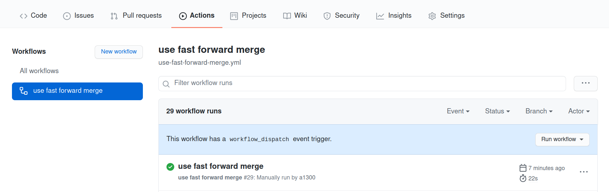
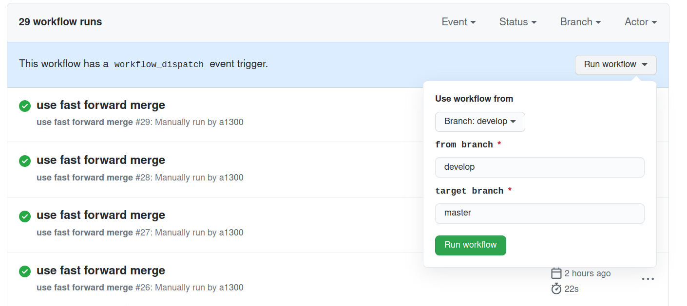

## Merge two branches without a commit message (fast-forward)

This action merges on the same repo branch `x` into `y`. A merge is only started if a `fast-fowrad` merge is possible.

The action needs to be started with a mouse click (`workflow dispatch`).



<br/>


You can configure the default branches which should be merged. Here we have as default that the `develop` branch should be merged into the `master` branch.



### Setup

Create a file in your local `.github/workflows` directory:

```bash
mkdir -p .github/workflows
touch .github/workflows/use-fast-forward-merge.yml
```

```yml
name: use fast forward merge
on:
  workflow_dispatch:
    inputs:
      fromBranch:
        description: 'from branch'  
        required: true
        default: 'develop'
      targetBranch:
        description: 'target branch'  
        required: true
        default: 'master'

jobs:
  run-merge:
    runs-on: ubuntu-latest
    steps:
      - name: Checkout Branch
        uses: actions/checkout@v2
        with:
          fetch-depth: 0
      - uses: GNYIO/actions-fast-forward-merge@main
        with:
          from_branch: ${{ github.event.inputs.fromBranch }}
          to_branch: ${{ github.event.inputs.targetBranch }}
```
